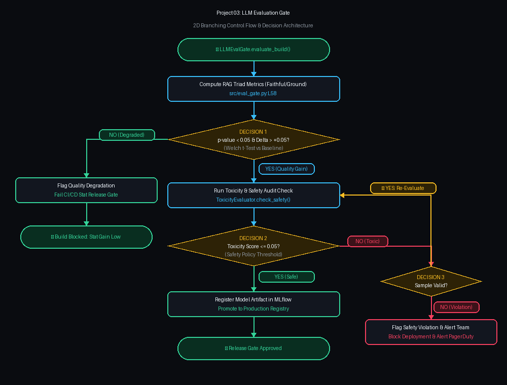

# ⚖️ Project 3: Multi-Model AI Evaluation Gate, LLM-as-a-Judge & MLflow System

> [!TIP]
> 🔀 **[CLICK HERE TO VIEW LIVE RENDERED FLOWCHART & CONTROL FLOW BLUEPRINT](https://abhi32dev.github.io/ai-infrastructure-platform/03-llm-eval-gate/FLOWCHART.html)**
> 
> 📄 **[View Architecture Reasoning & Design Trade-offs](PROD_ARCHITECTURE_REASONING.md)** | 🌐 **[Main Platform Showcase](https://abhi32dev.github.io/ai-infrastructure-platform/)**




---

A production-grade **AI Evaluation & Quality Governance Engine** implementing multi-model cross-verification (LLM-as-a-Judge), G-Eval / Ragas rubric scoring (Groundedness, Relevance, Faithfulness), MLflow prompt version tracking, and A/B statistical release gates using Welch's $t$-test $p$-value significance analysis.

---

## 🎯 Resume & Architecture Mapping

| Feature / Architectural Pattern | Resume Claim Mapped | Implementation Module |
| :--- | :--- | :--- |
| **LLM-as-a-Judge Cross Verification**| Multi-model evaluation gate | [`src/llm_as_judge.py`](src/llm_as_judge.py) |
| **Rubric Scoring Metrics** | Groundedness, relevance, hallucination detection | [`src/eval_rubrics.py`](src/eval_rubrics.py) |
| **Local Prototyping (Ollama)** | Ollama local model evaluation | [`src/llm_as_judge.py`](src/llm_as_judge.py) |
| **MLflow Experiment & Prompt Tracking**| Version tracking prompts, hyperparams, & metrics | [`src/mlflow_tracker.py`](src/mlflow_tracker.py) |
| **Statistical Release Gate (P-Value)**| A/B testing & $p$-value hypothesis validation | [`src/statistical_gate.py`](src/statistical_gate.py) |

---

## 📁 Repository Structure

```text
03-llm-eval-gate/
├── src/
│   ├── eval_rubrics.py       # Programmatic & heuristic rubric scorers (Groundedness, Relevance, Faithfulness)
│   ├── llm_as_judge.py       # Multi-model LLM-as-a-Judge cross-verification engine (Ollama + G-Eval)
│   ├── mlflow_tracker.py     # MLflow experiment tracking, prompt versioning, and metric logging
│   ├── statistical_gate.py   # Statistical release gate with Welch's t-test p-value significance analysis
│   └── eval_pipeline.py      # Master AI Evaluation Gate Orchestrator
├── data/
│   └── eval_datasets/        # Enterprise QA evaluation datasets & ground truth references
├── tests/
│   └── test_eval_gate.py     # Pytest test suite for rubrics, judge engine, MLflow, and release gates
├── app.py                    # FastAPI REST server & embedded Evaluation Visualizer Dashboard
├── demo_runner.py            # Interactive CLI script running 4 evaluation & release gate scenarios
├── requirements.txt          # Project dependencies
├── README.md                 # System documentation
└── INTERVIEW_PREP.md         # Staff AI Infra Interview Guide
```

---

## 🚦 Quick Start & Interactive Demo

### 1. Run the Interactive CLI Demo
```bash
python3 demo_runner.py
```
This executes 4 core production scenarios:
- **Scenario 1**: Programmatic Rubric Scoring (Groundedness & Relevance).
- **Scenario 2**: Multi-Model LLM-as-a-Judge Cross-Verification.
- **Scenario 3**: MLflow Experiment & Prompt Version Logging.
- **Scenario 4**: Statistical Release Gate & P-Value Validation (Welch's $t$-test).

### 2. Run Pytest Suite
```bash
pytest tests/
```

### 3. Launch FastAPI Server & Evaluation Dashboard
```bash
python3 app.py
```
Then open your browser to **http://127.0.0.1:8002** to run batch dataset evaluations and test statistical release gates visually!