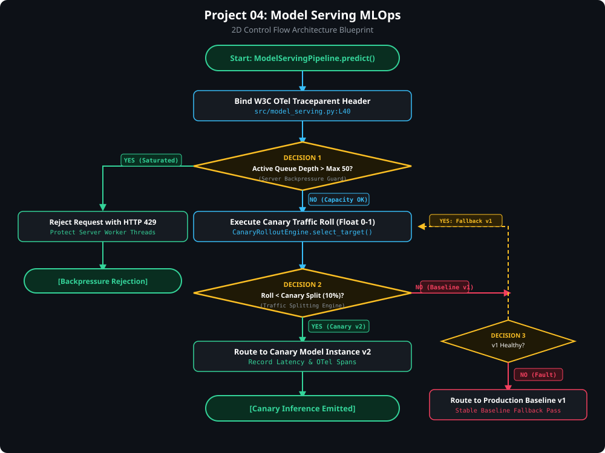

# ⚡ Project 4: Production Model Serving, RecSys & Real-Time MLOps Observability

> [!TIP]
> 🔀 **[CLICK HERE TO VIEW LIVE RENDERED FLOWCHART & CONTROL FLOW BLUEPRINT](https://abhi32dev.github.io/ai-infrastructure-platform/04-model-serving-mlops/FLOWCHART.html)**
> 
> 📄 **[View Architecture Reasoning & Design Trade-offs](PROD_ARCHITECTURE_REASONING.md)** | 🌐 **[Main Platform Showcase](https://abhi32dev.github.io/ai-infrastructure-platform/)**




---

A production-grade, local-first **Model Serving & MLOps Platform** implementing matrix factorization recommendation systems, user-item embedding similarity scoring, A/B test variant assignment, Server-Sent Events (SSE) token streaming, queue backpressure isolation, and OpenTelemetry / Prometheus metric collection (TTFT, TPS, P95/P99 latency).

---

## 🎯 Resume & Architecture Mapping

| Feature / Architectural Pattern | Resume Claim Mapped | Implementation Module |
| :--- | :--- | :--- |
| **Production RecSys & A/B Testing** | Personalized recommendations (7.4% revenue lift) | [`src/recsys_engine.py`](src/recsys_engine.py) |
| **SSE Token Streaming Proxy** | High-throughput async token streaming | [`src/streaming_proxy.py`](src/streaming_proxy.py) |
| **Backpressure Queue Isolation** | Decoupling & load-shedding under peak saturation | [`src/streaming_proxy.py`](src/streaming_proxy.py) |
| **OpenTelemetry TTFT/TPS Metrics** | TTFT, Tokens-Per-Second, P95/P99 latency | [`src/mlops_metrics.py`](src/mlops_metrics.py) |
| **Prometheus Exporter & SLA Governance**| SLI/SLO compliance (99.999% availability SLA) | [`src/mlops_metrics.py`](src/mlops_metrics.py) |

---

## 📁 Repository Structure

```text
04-model-serving-mlops/
├── src/
│   ├── recsys_engine.py       # Recommendation System (Matrix Factorization / Embedding Cosine Similarity)
│   ├── streaming_proxy.py      # Async SSE token streaming proxy with queue backpressure isolation
│   ├── mlops_metrics.py       # OpenTelemetry metrics collector & Prometheus exposition exporter
│   └── serving_orchestrator.py # Master Serving Platform Orchestrator
├── tests/
│   └── test_model_serving.py  # Pytest test suite for RecSys, SSE streaming, backpressure, & MLOps metrics
├── app.py                     # FastAPI REST API & embedded Model Serving & MLOps Visualizer Dashboard
├── demo_runner.py             # Interactive CLI script running 4 core serving & observability scenarios
├── requirements.txt           # Project dependencies
├── README.md                  # System documentation
└── INTERVIEW_PREP.md          # Staff AI Infra Interview Guide
```

---

## 🚦 Quick Start & Interactive Demo

### 1. Run the Interactive CLI Demo
```bash
python3 demo_runner.py
```
This executes 4 core production scenarios:
- **Scenario 1**: RecSys Personalization & A/B Variant Assignment.
- **Scenario 2**: High-Throughput SSE Token Streaming (TTFT & TPS).
- **Scenario 3**: Backpressure Queue Isolation under peak load saturation.
- **Scenario 4**: OpenTelemetry & Prometheus Metrics Export.

### 2. Run Pytest Suite
```bash
pytest tests/
```

### 3. Launch FastAPI Server & MLOps Dashboard
```bash
python3 app.py
```
Then open your browser to **http://127.0.0.1:8003** to test recommendation variants, trigger live SSE streams, and monitor real-time TTFT and P95/P99 latencies!