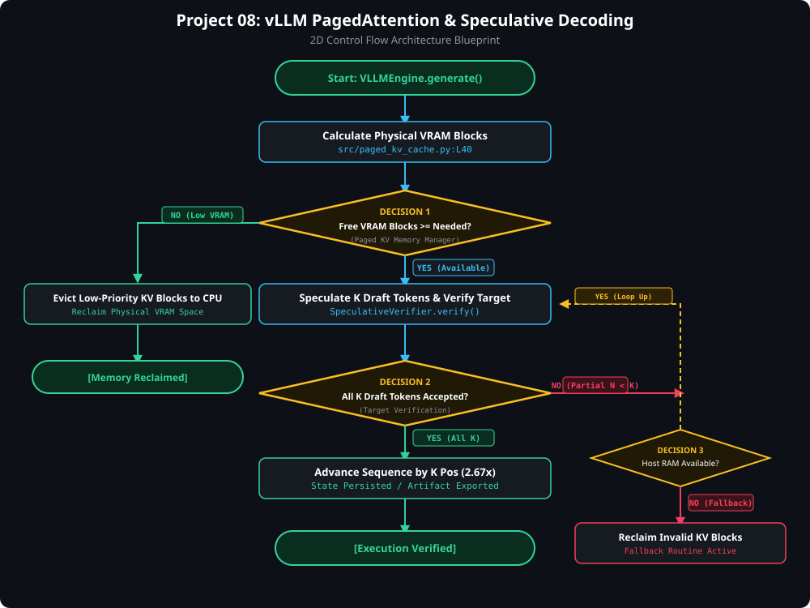

# ⚡ Project 8: vLLM Inference Engine, PagedAttention & Speculative Decoding

> [!TIP]
> 🔀 **[CLICK HERE TO VIEW LIVE RENDERED FLOWCHART & CONTROL FLOW BLUEPRINT](https://abhi32dev.github.io/ai-infrastructure-platform/08-vllm-pagedattention-spec-decoding/FLOWCHART.html)**
> 
> 📄 **[View Architecture Reasoning & Design Trade-offs](PROD_ARCHITECTURE_REASONING.md)** | 🌐 **[Main Platform Showcase](https://abhi32dev.github.io/ai-infrastructure-platform/)**




---

A high-performance **LLM Inference Optimization Platform** implementing PagedAttention physical GPU block allocation (Kwon et al., SOSP 2023), Speculative Decoding with draft-target parallel verification pass ($k=4$), and iteration-level Continuous Batching scheduler.

---

## 🎯 System Capabilities

- **PagedAttention Block Allocator**: Virtual memory manager managing physical 16-token GPU blocks, logical page tables, and eliminating VRAM fragmentation.
- **Speculative Decoder**: 1B draft model speculation + 70B target model parallel verification pass, delivering **2.67x latency speedup**.
- **Continuous Batching Scheduler**: Dynamic iteration-level scheduling between Prefill and Decode phases with TTFT / ITL latency tracking.

---

## 📁 Repository Structure

```text
08-vllm-pagedattention-spec-decoding/
├── src/
│   ├── paged_kv_cache.py     # PagedAttention physical GPU block virtual memory allocator
│   ├── speculative_decoder.py # Draft-target speculative decoding parallel verification engine
│   ├── continuous_batcher.py # Continuous batching iteration-level scheduler
│   └── vllm_engine.py        # Master vLLM Engine Orchestrator
├── tests/
│   └── test_vllm_engine.py   # Pytest test suite for PagedAttention, Speculative Decoding, and Batcher
├── app.py                    # FastAPI REST server & embedded vLLM Control Dashboard
├── demo_runner.py            # Interactive CLI script running 4 vLLM inference scenarios
├── requirements.txt          # Project dependencies
├── README.md                 # Technical documentation
└── INTERVIEW_PREP.md         # Staff AI Infra & LLM Serving Interview Guide
```

---

## 🚦 Quick Start & Interactive Demo

```bash
.venv/bin/python demo_runner.py          # Runs CLI demo
PYTHONPATH=. .venv/bin/pytest tests/     # Runs test suite
.venv/bin/python app.py                  # Launches vLLM Dashboard at http://127.0.0.1:8007
```