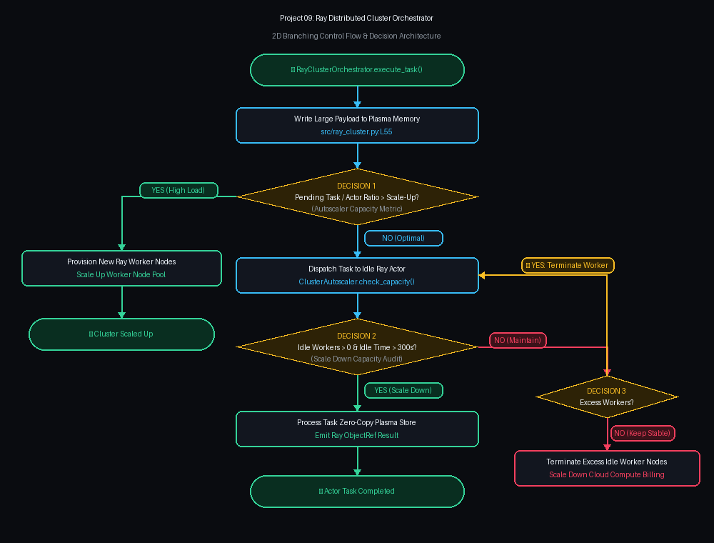

# 🛰️ Project 9: Ray Distributed Compute Cluster, Ray Serve & Multi-GPU Orchestrator

> [!TIP]
> 🔀 **[CLICK HERE TO VIEW LIVE RENDERED FLOWCHART & CONTROL FLOW BLUEPRINT](https://abhi32dev.github.io/ai-infrastructure-platform/09-ray-distributed-cluster-orchestrator/FLOWCHART.html)**
> 
> 📄 **[View Architecture Reasoning & Design Trade-offs](PROD_ARCHITECTURE_REASONING.md)** | 🌐 **[Main Platform Showcase](https://abhi32dev.github.io/ai-infrastructure-platform/)**




---

A production-grade **Distributed AI Computing & Cluster Orchestrator** implementing stateful Ray Actor worker pools, Plasma zero-copy shared memory object store referencing, multi-GPU node dynamic autoscaling, and fault-tolerant actor state recovery.

---

## 🎯 System Capabilities

- **Stateful Ray Actor Pool**: Multi-node GPU worker state manager with automated fault-tolerant recovery on hardware failures.
- **Plasma Zero-Copy Memory**: Shared memory object store reference tracker eliminating serialization overhead for large model tensors.
- **Dynamic Cluster Autoscaler**: Queue-depth and GPU-utilization monitored cluster autoscaling engine.

---

## 📁 Repository Structure

```text
09-ray-distributed-cluster-orchestrator/
├── src/
│   ├── ray_actor_pool.py       # Distributed Ray Actor stateful pool & Plasma object store
│   ├── cluster_autoscaler.py   # Ray cluster dynamic autoscaler & resource monitor
│   └── ray_cluster_manager.py  # Master Ray Distributed Cluster Orchestrator
├── tests/
│   └── test_ray_cluster.py     # Pytest test suite for Ray Actor pool, autoscaler, and recovery
├── app.py                      # FastAPI REST server & embedded Ray Dashboard
├── demo_runner.py              # Interactive CLI script running 4 Ray cluster scenarios
├── requirements.txt            # Project dependencies
├── README.md                   # Technical documentation
└── INTERVIEW_PREP.md           # Staff AI Infra & Ray Cluster Interview Guide
```

---

## 🚦 Quick Start & Interactive Demo

```bash
.venv/bin/python demo_runner.py          # Runs CLI demo
PYTHONPATH=. .venv/bin/pytest tests/     # Runs test suite
.venv/bin/python app.py                  # Launches Ray Dashboard at http://127.0.0.1:8008
```