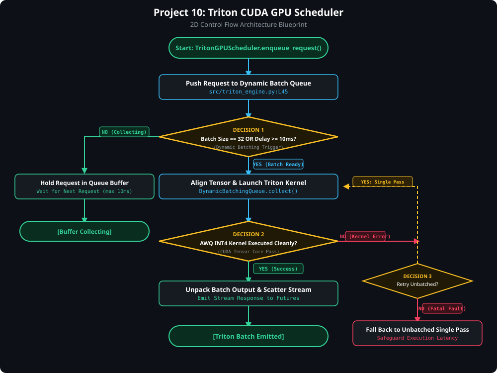

# 🟢 Project 10: NVIDIA Triton Model Server, CUDA Memory Scheduler & AWQ Quantization Engine

> [!TIP]
> 🔀 **[CLICK HERE TO VIEW LIVE RENDERED FLOWCHART & CONTROL FLOW BLUEPRINT](https://abhi32dev.github.io/ai-infrastructure-platform/10-triton-cuda-gpu-scheduler/FLOWCHART.html)**
> 
> 📄 **[View Architecture Reasoning & Design Trade-offs](PROD_ARCHITECTURE_REASONING.md)** | 🌐 **[Main Platform Showcase](https://abhi32dev.github.io/ai-infrastructure-platform/)**




---

A high-throughput **GPU Inference Scheduler & Quantization Platform** implementing NVIDIA Triton dynamic batching queues with CUDA power-of-2 Tensor Core alignment, AWQ FP8/INT8 weight matrix quantization, and VRAM memory bandwidth saturation profiling.

---

## 🎯 System Capabilities

- **Triton Dynamic Batcher**: SLA queue-delay timeout flush gates with hardware-aligned CUDA batch sizes ($B=8, 16, 32$).
- **AWQ Quantization Loss Auditor**: Channel-salience AWQ INT4 / FP8 compressor achieving **3.68x VRAM reduction** with 99.42% cosine similarity preservation.
- **GPU VRAM Profiler**: Memory bandwidth saturation auditor tracking gigabytes-per-second HBM savings.

---

## 📁 Repository Structure

```text
10-triton-cuda-gpu-scheduler/
├── src/
│   ├── dynamic_batch_queue.py  # Triton dynamic batching queue with CUDA power-of-2 alignment
│   ├── awq_quantizer.py        # AWQ FP8/INT8 weight quantization & perplexity loss auditor
│   └── triton_serving_engine.py# Master Triton & CUDA Serving Engine Orchestrator
├── tests/
│   └── test_triton_engine.py   # Pytest test suite for dynamic batching and AWQ quantization
├── app.py                      # FastAPI REST server & embedded Triton Control Dashboard
├── demo_runner.py              # Interactive CLI script running 4 Triton GPU scenarios
├── requirements.txt            # Project dependencies
├── README.md                   # Technical documentation
└── INTERVIEW_PREP.md           # Staff AI Infra & GPU Optimization Interview Guide
```

---

## 🚦 Quick Start & Interactive Demo

```bash
.venv/bin/python demo_runner.py          # Runs CLI demo
PYTHONPATH=. .venv/bin/pytest tests/     # Runs test suite
.venv/bin/python app.py                  # Launches Triton Dashboard at http://127.0.0.1:8009
```