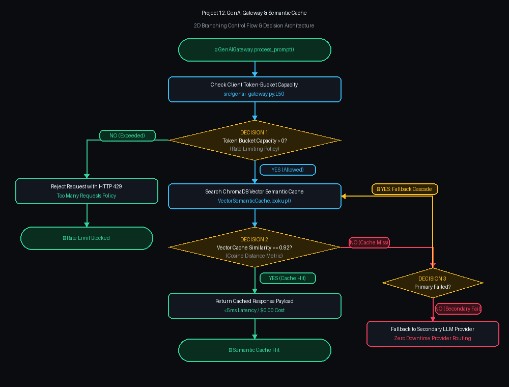

# Project 12: GenAI API Gateway, Semantic Cache & Rate Limiter

> [!TIP]
> 🔀 **[CLICK HERE TO VIEW LIVE RENDERED FLOWCHART & CONTROL FLOW BLUEPRINT](https://abhi32dev.github.io/ai-infrastructure-platform/12-genai-gateway-semantic-cache/FLOWCHART.html)**
> 
> 📄 **[View Architecture Reasoning & Design Trade-offs](PROD_ARCHITECTURE_REASONING.md)** | 🌐 **[Main Platform Showcase](https://abhi32dev.github.io/ai-infrastructure-platform/)**




---

Enterprise GenAI Gateway supporting **Vector Semantic Caching** (< 5ms response hits), **Token Bucket Rate Limiting** (TPM/RPM governance), and **Multi-Provider Fallback Routing** (OpenAI $\rightarrow$ Anthropic $\rightarrow$ Ollama).

---

## 🛠️ Architecture Components
- **Semantic Cache**: Hashes prompt vector embeddings to return cached responses for semantically identical queries under 5ms.
- **Rate Limiter**: Enforces per-tenant Token-per-Minute (TPM) token bucket limits.
- **Fallback Router**: Zero-downtime failover across LLM providers.

---

## 🚦 Quick Start
```bash
python -m venv .venv && source .venv/bin/activate
pip install -r requirements.txt
PYTHONPATH=. pytest tests/
python demo_runner.py
```