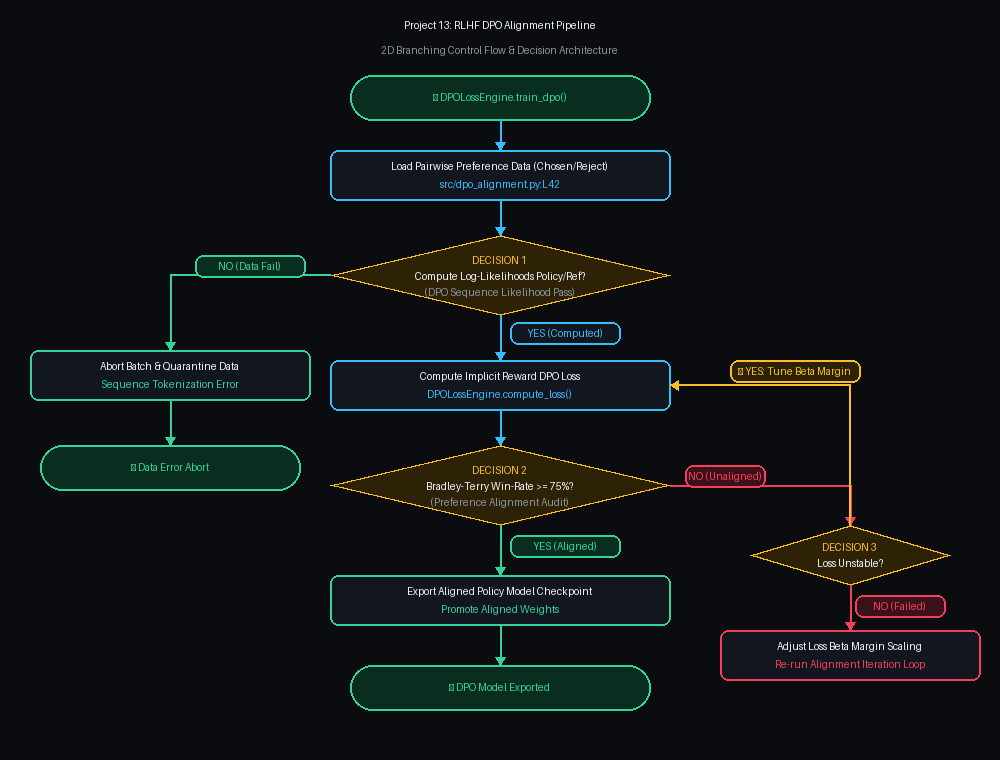

# Project 13: Direct Preference Optimization (DPO) & RLHF Alignment Pipeline

> [!TIP]
> 🔀 **[CLICK HERE TO VIEW LIVE RENDERED FLOWCHART & CONTROL FLOW BLUEPRINT](https://abhi32dev.github.io/ai-infrastructure-platform/13-rlhf-dpo-alignment-pipeline/FLOWCHART.html)**
> 
> 📄 **[View Architecture Reasoning & Design Trade-offs](PROD_ARCHITECTURE_REASONING.md)** | 🌐 **[Main Platform Showcase](https://abhi32dev.github.io/ai-infrastructure-platform/)**




---

LLM alignment platform implementing **Direct Preference Optimization (DPO)** without needing separate reward model training, calculating implicit policy rewards and auditing Bradley-Terry win-rate metrics.

---

## 🛠️ Architecture Components
- **Preference Dataset Curator**: Structures pairwise $(prompt, y_w, y_l)$ chosen vs rejected tuple datasets.
- **DPO Loss Calculator**: Computes implicit rewards $r(x,y) = \beta \log \frac{\pi_\theta(y|x)}{\pi_{\text{ref}}(y|x)}$ and sigmoid DPO loss.
- **Reward Model Auditor**: Evaluates Bradley-Terry win rates and checks KL divergence drift bounds.

---

## 🚦 Quick Start
```bash
python -m venv .venv && source .venv/bin/activate
pip install -r requirements.txt
PYTHONPATH=. pytest tests/
python demo_runner.py
```