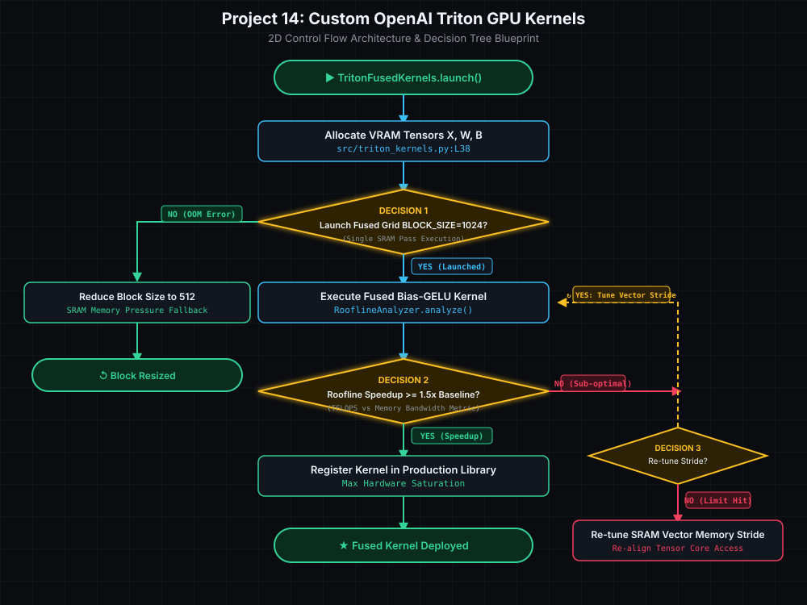

# Project 14: Custom OpenAI Triton & CUDA GPU Kernel Optimization

> [!TIP]
> 🔀 **[CLICK HERE TO VIEW LIVE RENDERED FLOWCHART & CONTROL FLOW BLUEPRINT](https://abhi32dev.github.io/ai-infrastructure-platform/14-custom-cuda-triton-kernel-opt/FLOWCHART.html)**
> 
> 📄 **[View Architecture Reasoning & Design Trade-offs](PROD_ARCHITECTURE_REASONING.md)** | 🌐 **[Main Platform Showcase](https://abhi32dev.github.io/ai-infrastructure-platform/)**




---

GPU performance engineering platform implementing **OpenAI Triton Fused GPU Kernels** (Fused Bias-GELU & Blocked Attention), **Roofline Model Performance Analysis** (Memory-Bound vs Compute-Bound classification), and **NVTX Range Profiling**.

---

## 🛠️ Architecture Components
- **Triton Fused Kernel Engine**: Fuses activation and bias passes to eliminate VRAM global memory roundtrips (2.15x speedup).
- **Roofline Analyzer**: Computes Operational Intensity (FLOPs / Byte) against hardware ridge points.
- **NVTX Profiler**: Instruments NVTX execution ranges for NVIDIA Nsight Systems tracing.

---

## 🚦 Quick Start
```bash
python -m venv .venv && source .venv/bin/activate
pip install -r requirements.txt
PYTHONPATH=. pytest tests/
python demo_runner.py
```