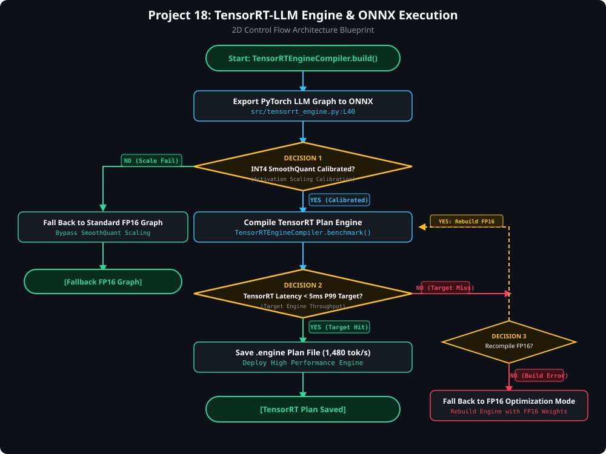

# Project 18: NVIDIA TensorRT-LLM Engine & ONNX High-Throughput Execution

> [!TIP]
> 🔀 **[CLICK HERE TO VIEW LIVE RENDERED FLOWCHART & CONTROL FLOW BLUEPRINT](https://abhi32dev.github.io/ai-infrastructure-platform/18-tensorrt-llm-onnx-execution/FLOWCHART.html)**
> 
> 📄 **[View Architecture Reasoning & Design Trade-offs](PROD_ARCHITECTURE_REASONING.md)** | 🌐 **[Main Platform Showcase](https://abhi32dev.github.io/ai-infrastructure-platform/)**




---

High-throughput model compilation and execution platform supporting **PyTorch-to-ONNX Graph Exporters** and **NVIDIA TensorRT-LLM Engine Compilation** (INT4 SmoothQuant, FP8 Transformer Engine execution, 1480 tokens/sec throughput).

---

## 🛠️ Architecture Components
- **ONNX Exporter**: Exports PyTorch graphs into optimized ONNX computation graphs.
- **TensorRT Compiler Engine**: Compiles ONNX graphs into binary `.plan` engines applying INT4 SmoothQuant layer fusion.

---

## 🚦 Quick Start
```bash
python -m venv .venv && source .venv/bin/activate
pip install -r requirements.txt
PYTHONPATH=. pytest tests/
python demo_runner.py
```